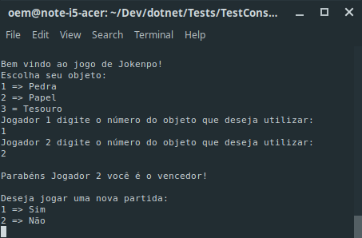

# Jokenpo
Jokenpo é uma brincadeira japonesa, onde dois jogadores escolhem um dentre três possíveis itens: Pedra, Papel ou Tesoura.

O objetivo foi um juiz de Jokenpo que dada a jogada dos dois jogadores informa o resultado da partida.

As regras são as seguintes:

* Pedra empata com Pedra e ganha de Tesoura
* Tesoura empata com Tesoura e ganha de Papel
* Papel empata com Papel e ganha de Pedra

---
### Jogo rodando no terminal


Para rodar o projeto é necessário:
-----------
* .net core 3.0

* Executar o comando a seguir no terminal dentro da pasta raíz do projeto para rodar a aplicação:
```
dotnet run
```